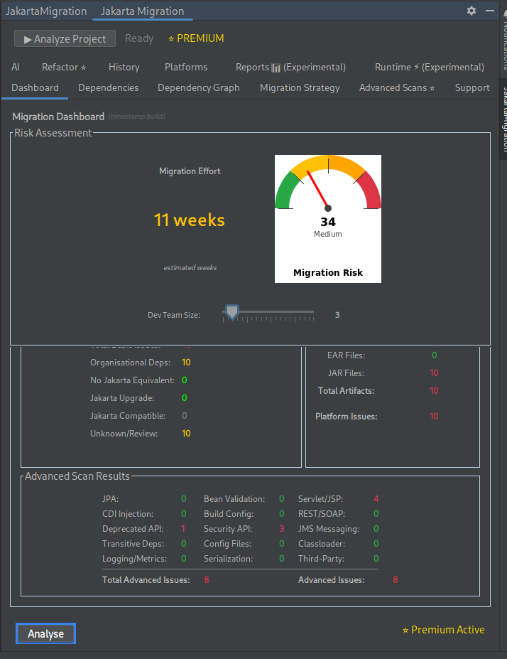
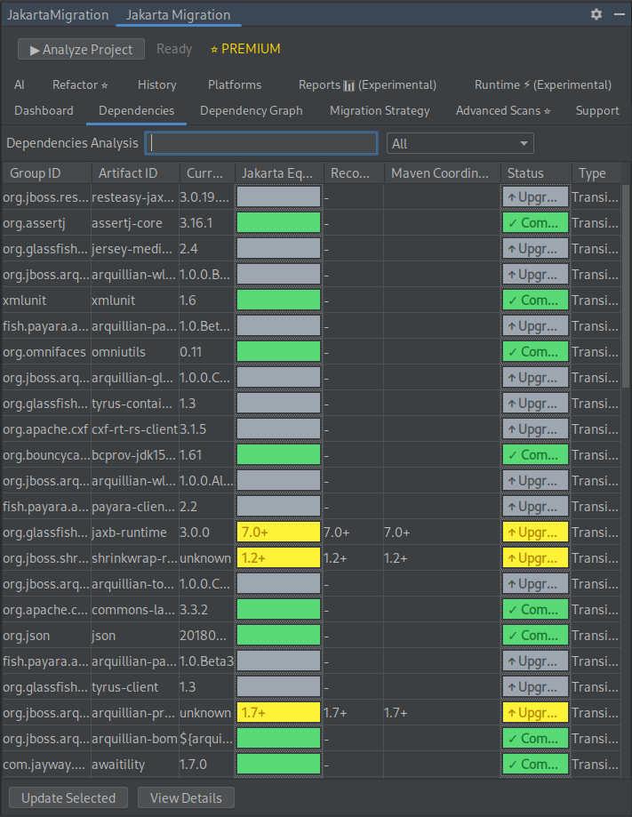
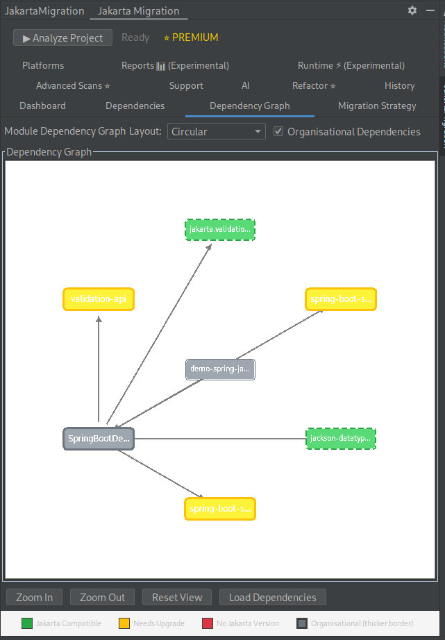
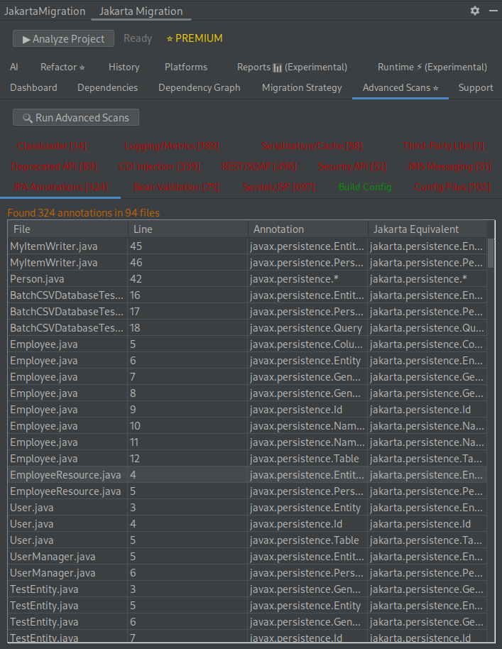
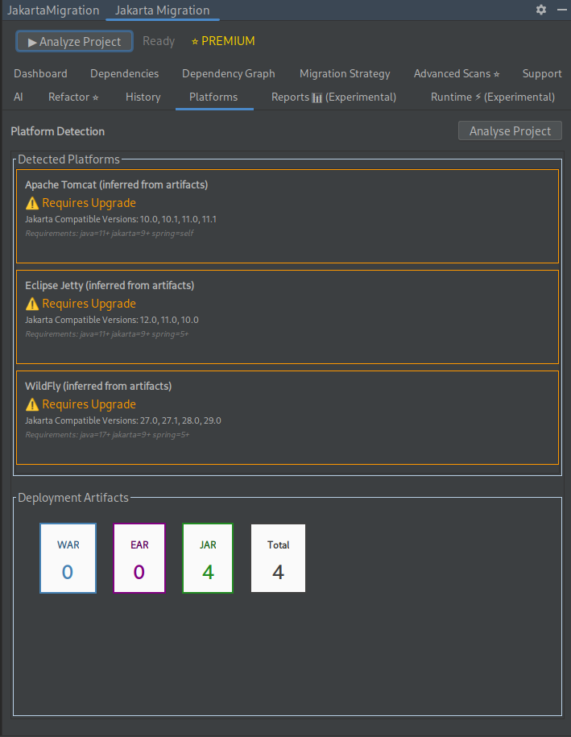
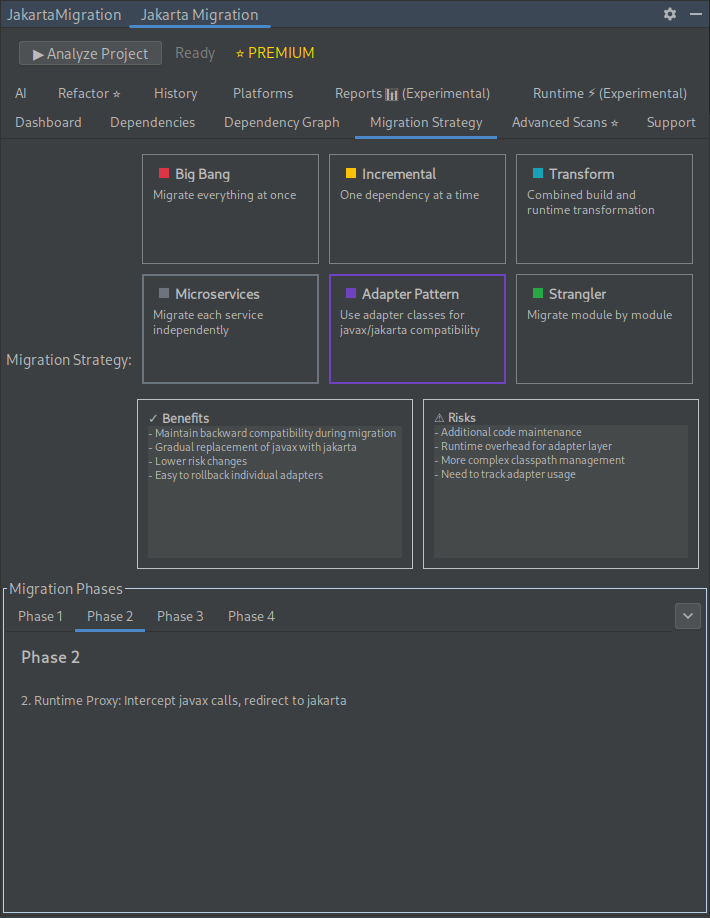
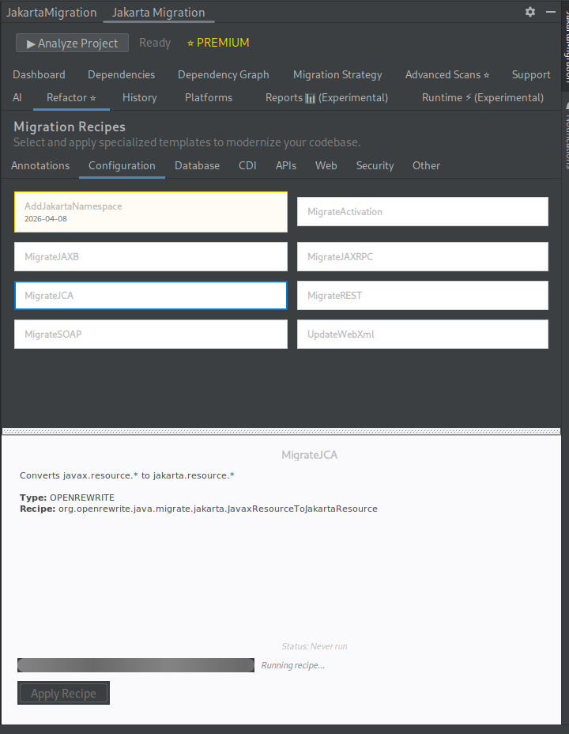
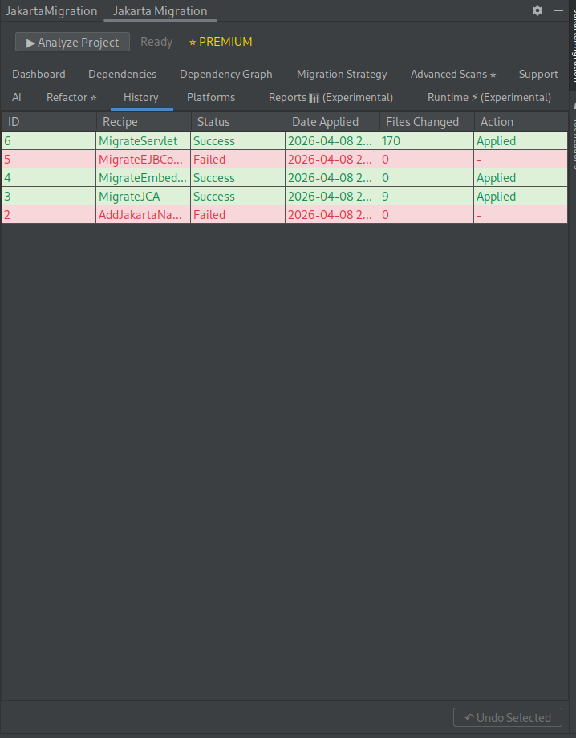

# 🚀 Jakarta Migration (javax → jakarta)

**Analyze, plan, and automate your Java EE → Jakarta EE migration — directly inside IntelliJ.**

Migrate from Java EE 8 (`javax.*`) to Jakarta EE 9+ with confidence.
This plugin detects migration blockers, analyzes dependencies, and helps you refactor safely using OpenRewrite.

---

## ⚠️ Why This Matters

The transition from `javax.*` to `jakarta.*` is **not a simple rename**.

* Dependencies break
* Frameworks require upgrades
* Application servers must change
* Hidden references cause runtime failures

This plugin helps you **identify risks early and migrate systematically**.

---

## 🖥️ IntelliJ IDEA Plugin

### Download

**[Get it from JetBrains Marketplace →](https://plugins.jetbrains.com/plugin/30093-jakarta-migration)**

---

## 🔍 What You Can Do

### 📊 Analyze Your Project

* Scan your entire codebase for `javax.*` usage
* Identify migration blockers and compatibility issues
* Estimate migration effort and risk

### 📦 Understand Dependencies

* Detect which dependencies are Jakarta-compatible
* Get recommendations for compatible versions
* Visualize module relationships with dependency graphs

### 🧠 Plan Your Migration

* Compare migration strategies
* Identify required platform upgrades (Spring, app servers, etc.)

### ✅ Validate Migration Readiness

* **Enhanced Test Coverage Analysis**: Detects integration tests that actually validate javax/jakarta compatibility
* **Critical Risk Zone Detection**: Identifies modules with migration issues AND insufficient test coverage
* **Migration-Aware Confidence Scoring**: Prioritizes tests that catch real migration issues over mocked unit tests

### 📄 Generate Professional Reports

* **HTML-to-PDF Reports**: Beautiful, professional reports with executive summaries
* **Multiple Templates**: Professional, Technical, and Minimal report styles
* **Comprehensive Analysis**: Dependencies, platforms, advanced scanning, and recommendations
* Make informed decisions before changing code

### ⚡ Refactor with Confidence

* Apply OpenRewrite-powered refactoring recipes
* Automatically transform `javax.*` → `jakarta.*`
* Undo changes with built-in history

---

## 🤖 AI-Powered Capabilities

* MCP tools integrated with JetBrains AI Assistant
* Assist with migration decisions and code changes

---

## 🧪 Experimental Features

* **Runtime Analysis** – Detect runtime issues and suggest fixes
* **Reports** – Export migration analysis as PDF

---

## 🧰 Supported Technologies

* **Java:** 11, 17, 21, 25
* **Build Tools:** Maven, Gradle
* **Frameworks:** Spring Boot 3+, Spring Framework 6+, Jakarta EE 9+
* **Application Servers:**
  Tomcat 10+, WildFly 27+, Jetty 12+, Open Liberty 23+, Payara 7+, JBoss EAP 8+, WebSphere, WebLogic
* **Jakarta APIs:**
  Servlet, JSP, JPA, CDI, Bean Validation, JAX-RS, JAX-WS, JMS, WebSocket, JSON-B, JSON-P

---

## 🚀 Getting Started

1. **Run Analysis** – Scan your project for `javax.*` usage
2. **Review Results** – Understand risks and migration effort
3. **Plan Strategy** – Choose the best migration approach
4. **Refactor** – Apply automated OpenRewrite recipes
5. **Verify** – Re-run analysis to confirm migration success

---

## ⚙️ Technical Details

* Built on the IntelliJ Platform
* Uses OpenRewrite for safe, automated transformations
* Performs static analysis across source code, dependencies, and configs
* Compatible with IntelliJ IDEA 2023.3+ (Community & Ultimate)

---

## 💡 Free vs Premium

**Free**

* Migration risk analysis
* Dependency scans
* Version recommendations
* Migration strategy insights

**Premium**

* One-click refactoring
* Platform detection (frameworks, app servers)
* Advanced scans and analysis
* PDF reports
* AI-assisted migration tools

---

## 🎯 Who This Is For

* Enterprise Java teams upgrading to Jakarta EE
* Developers maintaining legacy Java EE systems
* Teams migrating to Spring Boot 3+ or modern app servers

## Technical Documentation

**[View the Github Wiki →](https://github.com/adrianmikula/JakartaMigrationMCP/wiki)**

## Screenshots

  

    
  

  

    
  

  

    
  

  

    
  

  

    
  

  

    
  

  

    
  

  

    
  

